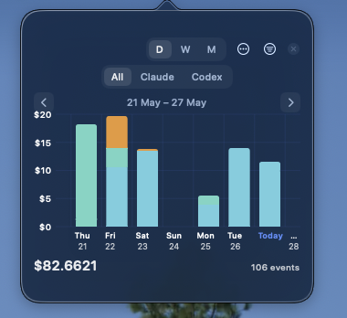

# ai-plugins

Plugins for Claude Code and Codex CLI, plus a native macOS token usage widget.

- [`plugin/`](plugin/) — shared plugin source: hosts both Claude and Codex manifests plus all hook scripts
- [`token-usage-app/`](token-usage-app/) — macOS floating widget to visualise AI spend

**[▶ Try the Token Usage app live](https://lamphamtl.github.io/ai-plugins/token-usage-app/snapshot.html)** — interactive HTML preview, no install needed.

## Components

### Claude Code plugin

Token usage logging, live statusline, compaction tracking, git intent shortcuts.

Hooks fire on `Stop`, `UserPromptSubmit`, `PreCompact`, and `PostCompact`. Each `Stop` appends an incremental JSONL entry to `~/.claude/token-usage/usage.jsonl` with timestamp, session ID, model, project name, per-type token deltas, and cost in USD.

### Codex plugin

Token usage logging and git intent shortcuts.

Hooks fire on `Stop` and `UserPromptSubmit`. Each `Stop` reads the session transcript JSONL, computes incremental token deltas, and appends an entry to `~/.codex/token-usage/usage.jsonl`.

### Token Usage App

Native macOS floating widget built with SwiftUI + Swift Charts. Reads from both `~/.claude/token-usage/usage.jsonl` and `~/.codex/token-usage/usage.jsonl` and renders cost over time as a bar chart with source filtering (All / Claude / Codex).



See [`token-usage-app/README.md`](token-usage-app/README.md) for details and build instructions.

## Marketplace Installation

**Claude Code:**
```bash
claude plugin marketplace add lamphamTL/ai-plugins --sparse .claude-plugin plugin
claude plugin install claude-assistant@ai-plugins
```

**Codex:**
```bash
codex plugin marketplace add lamphamTL/ai-plugins --sparse .agents/plugins --sparse plugin
codex plugin add codex-assistant@ai-plugins
```

Bundled plugin hooks in Codex still experimental. Enable feature flags in `~/.codex/config.toml`:

```toml
[features]
hooks = true
plugin_hooks = true
```

Hooks installed from plugin not enabled by default. Turn them on either by updating `~/.codex/config.toml` or from Codex Desktop App.

## Updating plugins after hook changes

The marketplace sparse clone doesn't auto-pull on reinstall.

**Claude Code:**
```bash
git -C ~/.claude/plugins/marketplaces/ai-plugins pull
claude plugins uninstall claude-assistant@ai-plugins
claude plugins install claude-assistant@ai-plugins
```

**Codex:**
```bash
codex plugin marketplace upgrade ai-plugins
```
